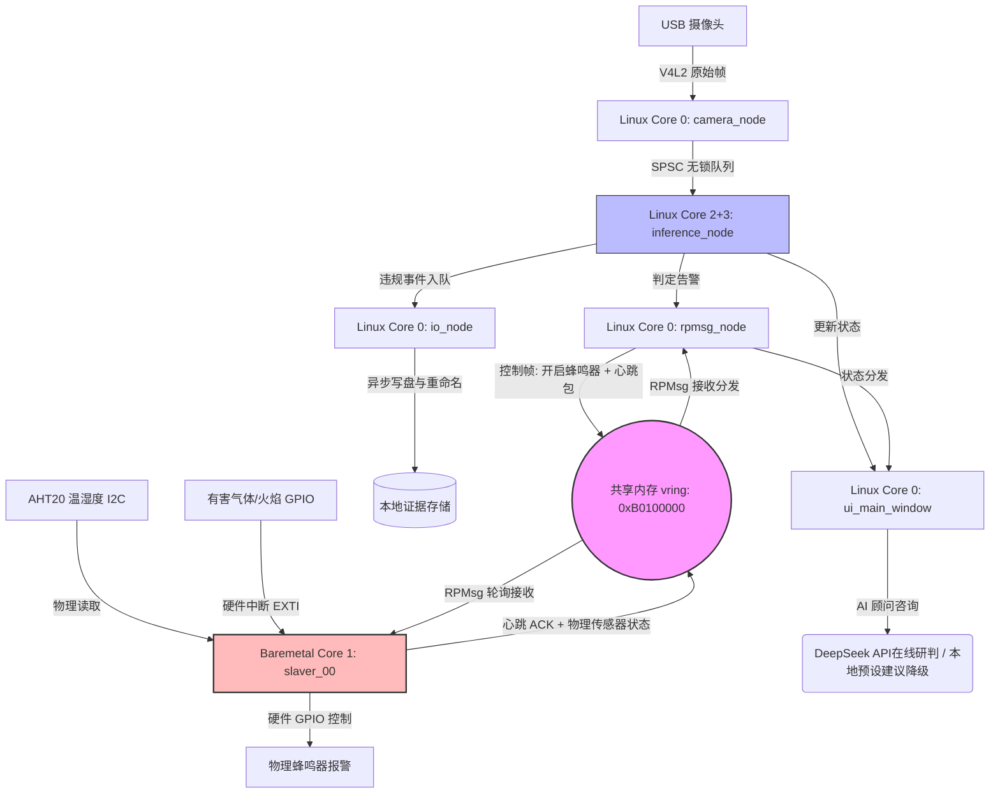

# 📖 架构全景图 - 硬件布局、内存映射、数据流、核心关键文件索引

> **项目架构**：飞腾派 E2000Q 异构多核平台 (Cortex-A72 × 4)  
> **核心组件**：Linux 主核系统 (Core 0/2/3) + Baremetal 从核系统 (Core 1) + 共享物理内存通信总线 (OpenAMP)

---

## 1. 物理引脚与外设硬件布局

本系统充分利用了飞腾派 E2000Q 的外设总线，由从核 Baremetal 接管所有的物理报警与前哨环境传感器：

```
                    飞腾派 E2000Q 开发板 J2/J3 引脚排针
      ┌────────────────────────────────────────────────────────┐
      │  5V   5V   GND  TX1   RX1  ...  I2C1_SDA I2C1_SCL GND  │
      │  [●]  [●]  [●]  [●]   [●]  ...    [●]      [●]    [●]  │
      │   1    2    3    4     5            9       10     11  │
      └───────────────────┬───────────────┬────────┬───────────┘
                          │               │        │
                          ▼               ▼        ▼
                      物理蜂鸣器        AHT20      MQ-2 气体 /
                      (引脚 GPIO)      温湿度传感器 火焰传感器 (GPIO)
```

*   **物理蜂鸣器 (Buzzer)**：连接至 GPIO 引脚，由从核控制其高低电平，实现物理蜂鸣器报警（继电器接口可扩展）。
*   **AHT20 温湿度传感器**：经 MIO1 的 I2C1 接口接入（Pin 3 为 SDA、Pin 5 为 SCL），由 Core 1 轮询采集并通过 RPMsg 上报。
*   **MQ-2 气体传感器 & 火焰传感器**：连接至 GPIO 中断引脚，利用飞腾硬件 EXTI 中断控制器，跳过 Linux 调度实现微秒级中断响应。
*   **USB 摄像头**：插在物理 USB 3.0 接口上，由 Linux 主核的 V4L2 驱动直接拉流。

---

## 2. 物理内存映射表 (Memory Map)

为实现 Linux 主核与从核裸机的物理物理级隔离，我们重构了飞腾派底层系统设备树 (DTS)，将物理内存划分为以下三个专属区域：

| 物理地址区间 | 长度 | 访问权限 | 功能描述 | 隔离安全意义 |
| :--- | :--- | :--- | :--- | :--- |
| `0x80000000` 起始 | 独立内存 | 仅从核 (Core 1) | 从核 Standalone 固件运行空间 | 从核固件链接并运行于该隔离区域，Linux侧保护机制以实际DTS和启动日志为准 |
| `0xB0100000` - `0xB01FFFFF` | 1 MB | 主从核共享 (Shared) | OpenAMP vring 与 RPMsg 共享缓冲内存 | 物理共享通道，用于高速数据帧和控制信令交互 |
| 其他物理内存区间 | 剩余 | 仅主核 (Core 0/2/3)| Linux 系统及应用程序运行空间 | 跑 Linux OS、加载 NCNN 矩阵模型和 Qt 运行库 |

> [!IMPORTANT]
> **物理隔离的价值**：传统的单操作系统（SMP）下，一旦 Linux 发生 kernel panic 或 OOM，可能导致Linux应用或服务失效。通过上述物理内存划分，Core 1 从核在独立的 `0x80000000` 内存段上运行，实现了独立安全执行域。

---

## 3. 异构多核数据流拓扑图

系统的数据流和控制流在两个隔离的硬件域之间流转，其整体逻辑流向如下：



---

## 4. 全栈源码关键文件索引与角色映射

为便于评审与复现，全栈交付源码按逻辑架构清晰组织如下：

### 4.1 Linux 主核系统域 (`ppe_system/`)

| 文件路径 | 对应大纲章节 | 核心角色与功能说明 |
| :--- | :--- | :--- |
| [main.cpp](../ppe_system/src/main.cpp) | 4.1 / 4.4.3 | 系统生命周期入口，注册全局信号量捕获，异常时优雅关闭从核电源 (PSCI) |
| [camera_node.cpp](../ppe_system/src/camera_node.cpp) | 4.1 | 摄像头拉流工作节点，绑定于 Core 0，提供无感视频热切换逻辑 |
| [inference_node.cpp](../ppe_system/src/inference_node.cpp) | 5.1 / 5.2 | AI 推理大脑，绑定双大核 Core 2+3，调用 NCNN 进行 INT8 QAT 推理，挂载 ByteTrack |
| [rpmsg_node.cpp](../ppe_system/src/rpmsg_node.cpp) | 6.1 | OpenAMP RPMsg 主核侧协议栈驱动，负责心跳定时器、CRC8 校验和数据包分发 |
| [io_node.cpp](../ppe_system/src/io_node.cpp) | 4.4 | 异步 I/O 文件写盘引擎，执行原子重命名存图以及超水位（85%）磁盘防洪清理 |
| [ui_main_window.cpp](../ppe_system/src/ui_main_window.cpp) | 4.3 | Qt 零拷贝监控主屏，包含主控看板、心跳状态状态灯以及违规滑动记录面板 |
| [deepseek_worker.cpp](../ppe_system/src/deepseek_worker.cpp) | 2.2.8 | DeepSeek AI 智能顾问异步后台，带 10s 请求超时机制与本地预设建议降级逻辑 |
| [lockfree_queue.hpp](../ppe_system/include/lockfree_queue.hpp) | 4.2 | 基于 C++11 原子屏障的 SPSC（单生产单消费）无锁队列，避免互斥锁竞争与生产消费路径阻塞 |

### 4.2 Baremetal 从核裸机域 (`Baremetal_Slave_Node/`)

| 文件路径 | 对应大纲章节 | 核心角色与功能说明 |
| :--- | :--- | :--- |
| [main.c](../Baremetal_Slave_Node/main.c) | 6.3 | 从核 Standalone 裸机系统的主入口，执行基本板级初始化 |
| [slaver_00_example.c](../Baremetal_Slave_Node/src/slaver_00_example.c) | 6.1 / 6.4 / 7.2 | 从核前哨站业务逻辑中枢。运行 OpenAMP 服务，驱动硬件看门狗 (WDT)，执行 Fail-Safe 安全接管 |
| [buzzer.c](../Baremetal_Slave_Node/src/buzzer.c) | 6.2 | 物理声光报警驱动（GPIO 底层高低电平控制） |
| [fire_sensor.c](../Baremetal_Slave_Node/src/fire_sensor.c) | 6.3.3 | 火焰传感器 GPIO EXTI 硬件中断初始化与服务子程序 (ISR)，保障中断优先级 0 |
| [aht20.c](../Baremetal_Slave_Node/src/aht20.c) | 6.3.1 | 从核 I2C 温湿度传感器驱动，实现轮询时序控制 |
| [gas_sensor.c](../Baremetal_Slave_Node/src/gas_sensor.c) | 6.3.2 | 可燃气体传感器数字 GPIO 输入状态读取逻辑 |
