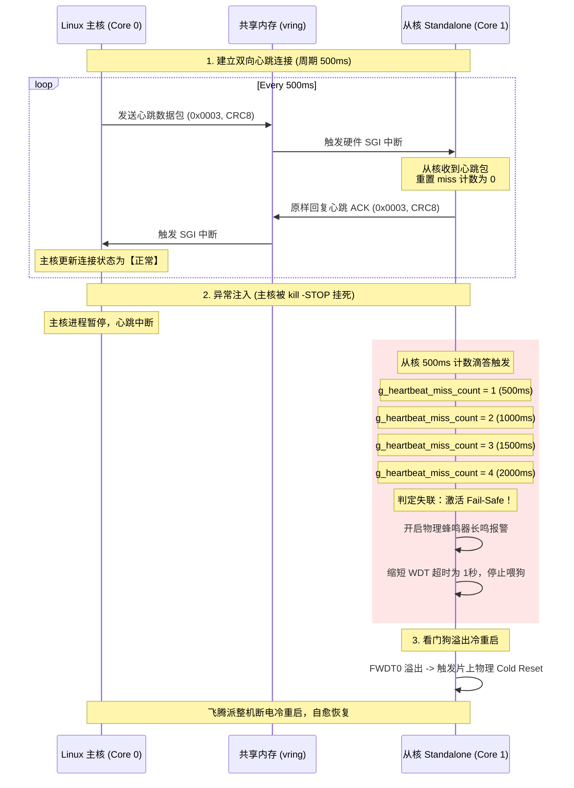

# 📖 通信流程详解 — 基于 OpenAMP/RPMsg 的数据共享总线

> **通信框架**：OpenAMP (Open Asymmetric Multi-Processing)  
> **传输层协议**：RPMsg (Remote Processor Messaging)  
> **底层载体**：片上共享内存 (SRAM/DDR) + 软件生成中断 (SGI) Mailbox

---

## 1. 异构多核通信原理

飞腾派 E2000Q 具备异构多核架构。为了在 Linux 主核与 Baremetal 从核之间实现低延迟的数据通道，本系统集成了 OpenAMP 异构框架：

```
    ┌────────────────────────┐              ┌────────────────────────┐
    │     Linux 主核域       │              │     Baremetal 从核域   │
    │  (Core 0/2/3, Master)  │              │    (Core 1, Slave)     │
    │                        │              │                        │
    │   ┌────────────────┐   │              │   ┌────────────────┐   │
    │   │  RPMsg Device  │   │              │   │  RPMsg Device  │   │
    │   └──────┬─────────┘   │              │   └────────┬───────┘   │
    └──────────┼─────────────┘              └────────────┼───────────┘
               │                                         │
               │   ┌─────────────────────────────────┐   │
               └──►│ 共享内存区 (0xB0100000)         │◄──┘
                   │ - VRING 0 (主 -> 从)            │
                   │ - VRING 1 (从 -> 主)            │
                   │ - RPMsg 缓冲区池                 │
                   └─────────────────────────────────┘
                       ▲                         ▲
                       │ Mailbox SGI 硬件中断     │
                       └─────────────────────────┘
```

*   **Vring 机制**：利用物理共享内存划分为两个环形缓冲区（Vring 0 和 Vring 1），分别用于存放下行和上行的数据。
*   **Mailbox 中断**：主核或从核向共享内存写入数据后，向对方核心发送一个软件生成中断（SGI），对方核心收到中断后在 ISR 中极速拉取数据，避免了传统的轮询开销。

---

## 2. 跨核通信协议帧结构

为保证传输的高效与安全，本系统定义了统一的数据包传输控制格式。

### 2.1 协议帧布局
```c
#pragma pack(push, 1) // 强制 1 字节物理对齐，消除不同位宽系统下的内存空隙
typedef struct {
    uint32_t command;           // 4 字节：命令控制字 (如 0x0003U 代表心跳包)
    uint16_t length;            // 2 字节：后续载荷实际字节大小
    char     data[256];         // 256 字节：可变长度数据载荷 (Payload)
    uint8_t  crc8;              // 1 字节：CRC-8/MAXIM 数据完整性校验码
} data_packet;
#pragma pack(pop)
```

### 2.2 控制命令字编码 (Commands)
*   `0x0001U` (DEVICE_CORE_START)：主核下发唤醒通知。
*   `0x0002U` (DEVICE_CORE_SHUTDOWN)：主核下发安全关机通知（从核调用 PSCI 下线）。
*   `0x0003U` (DEVICE_CORE_CHECK)：双向心跳包检测命令。
*   `0x0004U` (DEVICE_CORE_LED_CTRL)：主核下发板载 LED 开关指令。
*   `0x0005U` (DEVICE_CORE_BUZZER_CTRL)：主核下发声光报警阻断命令。
*   `0x0006U` (DEVICE_CORE_FIRE_REPORT)：从核上报底层火焰中断状态。
*   `0x0007U` (DEVICE_CORE_GAS_REPORT)：从核上报底层有害气体检测状态。
*   `0x0008U` (DEVICE_CORE_ENV_REPORT)：从核上报温湿度监测曲线数据（DHT11/AHT20）。

---

## 3. CRC-8/MAXIM 数据校验算法

为了规避共享内存在极端电磁干扰或 CPU 内存总线满载时的并发冲突（内存翻转、缓存污染），系统引入了 CRC-8/MAXIM 数据完整性检验。

### 3.1 算法多项式
*   **多项式**：\(x^8 + x^5 + x^4 + 1\)（数学表示为 `0x31`，即 `0b00110001`）。
*   **初始值**：`0xFF`。
*   **输入/输出反转**：高位优先模式（MSB First）。

### 3.2 C++ / C 代码实现 (双侧算法完全对齐)
```c
uint8_t Calc_CRC8_Maxim(const uint8_t *data, size_t len) {
    uint8_t crc = 0xFF; // 初始值为 0xFF
    for (size_t i = 0; i < len; ++i) {
        crc ^= data[i];
        for (int j = 0; j < 8; ++j) {
            if (crc & 0x80) {
                crc = (crc << 1) ^ 0x31; // 异或多项式 0x31
            } else {
                crc <<= 1;
            }
        }
    }
    return crc;
}
```
*   **校验范围**：计算范围覆盖结构体中的 `command` + `length` + `data[0..length-1]`，计算结果填入 `crc8`。
*   **接收校验流程**：接收侧收到数据包后，剥离末尾的 `crc8`，对前段数据再次计算 CRC8 并比对。不匹配的数据包被立刻丢弃，终端打印校验失败，且 UI 的 CRC 错误计数器累加。

---

## 4. 主从核心跳交互与超时监测时序

主从核的健康运行基于“双向心跳自愈机制”进行互相监督。其运行时序图如下：



---

## 5. 双向状态防抖机制

为防止现场电磁毛刺干扰或 AI 推理在临界点发生频繁抖动（例如人员在安全帽遮挡边缘反复走动），系统在跨核联动时应用了**非对称滞后防抖算法**：

*   **下行 AI 违规下发防抖**：
    *   主核 AI 推理如果检测到工人脱下安全帽（违规），需要连续 3 帧（约 270ms）判定为违规，才通过 RPMsg 向从核发送开启报警指令。
    *   当工人重新戴上安全帽（合规）后，主核必须连续检测到 15 帧（约 1.3 秒）完全合规，才向从核发送解除报警指令。此举有效消除了临界点的高频开关噪音。
*   **上行物理传感器报警防抖**：
    *   从核在物理 EXTI 中断服务程序（ISR）中，在 50ms 时间窗口内进行多次采样判决，防止由于现场大功率电机的电磁辐射导致火焰传感器产生毛刺误报。
