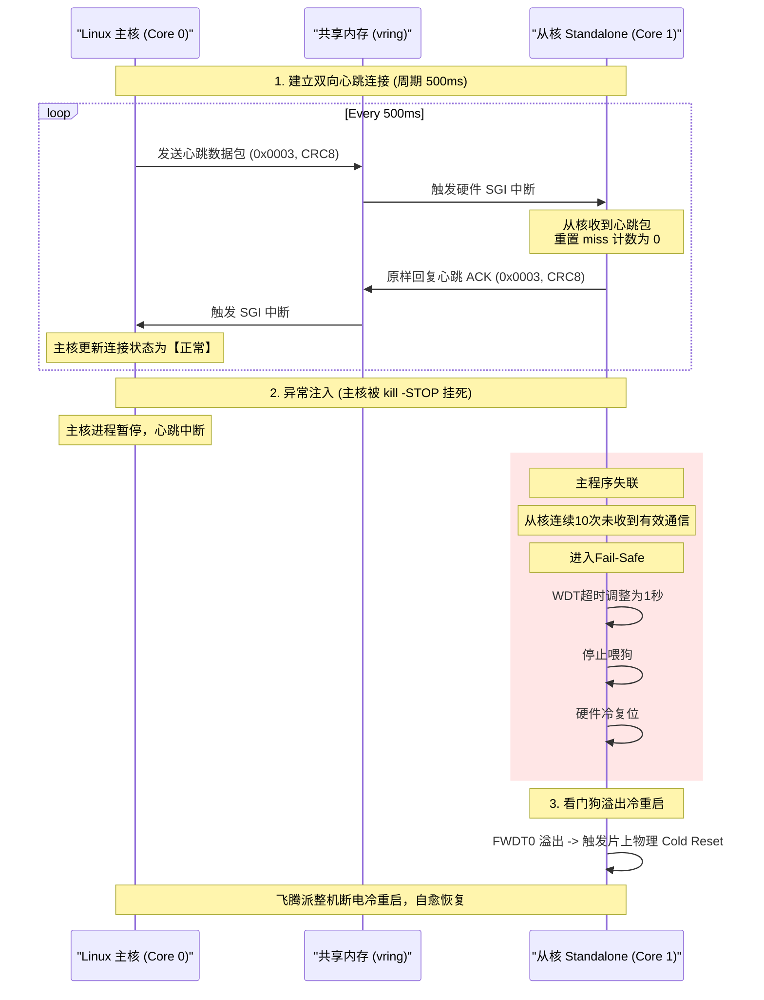

# 📖 通信流程详解 — 基于 OpenAMP/RPMsg 的数据共享总线

> **通信框架**：OpenAMP (Open Asymmetric Multi-Processing)  
> **传输层协议**：RPMsg (Remote Processor Messaging)  
> **底层载体**：片上共享内存 (SRAM/DDR) + 跨核通知唤醒机制

---

## 1. 异构多核通信原理

飞腾派 E2000Q 具备异构多核架构。为了在 Linux 主核与 Baremetal 从核之间实现低延迟的数据通道，本系统集成了 OpenAMP 异构框架：

```
    ┌────────────────────────┐              ┌────────────────────────┐
    │     Linux 主核域       │              │     Baremetal 从核域   │
    │  (Core 0/2/3, Master)  │              │    (Core 1, Slave)     │
    │                        │              │                        │
    │   ┌────────────────┐   │              │   ┌────────────────┐   │
    │   │  RPMsg Device  │   │              │   │  RPMsg Device  │   │
    │   └──────┬─────────┘   │              │   └────────┬───────┘   │
    └──────────┼─────────────┘              └────────────┼───────────┘
               │                                         │
               │   ┌─────────────────────────────────┐   │
               └──►│ 共享内存区 (0xB0100000)         │◄──┘
                   │ - VRING 0 (主 -> 从)            │
                   │ - VRING 1 (从 -> 主)            │
                   │ - RPMsg 缓冲区池                 │
                   └─────────────────────────────────┘
                       ▲                         ▲
                       │ 跨核通知唤醒机制           │
                       └─────────────────────────┘
```

*   **Vring 机制**：利用物理共享内存划分为两个环形缓冲区（Vring 0 和 Vring 1），分别用于存放下行和上行的数据。
*   **跨核唤醒机制**：RPMsg 基于共享内存中的 vring 传递数据，并通过平台提供的跨核通知机制唤醒对端处理。

---

## 2. 跨核通信协议帧结构

为保证传输的高效与安全，本系统定义了统一的数据包传输控制格式。

### 2.1 协议帧布局
```text
| command: 4B | length: 2B | payload: length B | CRC-8: 1B |
```
协议采用变长帧结构：数据流按 `6 + length` 的大小打包，序列化后再将 1 字节的 CRC-8 校验码追加至帧尾，不作为固定结构体直接传输。

### 2.2 控制命令字编码 (Commands)
*   `0x0001U` (DEVICE_CORE_START)：主核下发唤醒通知。
*   `0x0002U` (DEVICE_CORE_SHUTDOWN)：主核下发安全关机通知（从核调用 PSCI 下线）。
*   `0x0003U` (DEVICE_CORE_CHECK)：用于周期性心跳与回包确认；同时，从核将任意 CRC 校验通过的主核报文视为主核存活信号，刷新通信失联计数与看门狗。
*   `0x0004U` (DEVICE_CORE_LED_CTRL)：主核下发板载 LED 开关指令。
*   `0x0005U` (DEVICE_CORE_BUZZER_CTRL)：主核下发声光报警阻断命令。
*   `0x0006U` (DEVICE_CORE_FIRE_REPORT)：从核上报底层火焰中断状态。
*   `0x0007U` (DEVICE_CORE_GAS_REPORT)：从核上报底层有害气体检测状态。
*   `0x0008U` (DEVICE_CORE_ENV_REPORT)：从核上报温湿度监测曲线数据（DHT11/AHT20）。

---

## 3. CRC-8/MAXIM 数据校验算法

为了规避共享内存在极端电磁干扰或 CPU 内存总线满载时的并发冲突（内存翻转、缓存污染），系统引入了 CRC-8/MAXIM 数据完整性检验。

### 3.1 算法与实现对齐
系统采用 CRC-8/MAXIM 校验。实现使用初始值 `0x00`、LSB First 和反射多项式 `0x8C`；发送端对“命令字、长度、有效载荷”计算 CRC 并追加至帧尾，接收端校验失败后直接丢弃该帧。

---

## 4. 主从核心跳交互与超时监测时序

从核每 500ms 检查一次主核通信状态；连续 10 次检查未恢复，即约 5 秒后进入 Fail-Safe。随后将看门狗超时设置为 1 秒、刷新一次配置，并停止继续喂狗，等待硬件冷复位。其运行时序图如下：



---

## 5. 双向状态防抖机制

为防止现场电磁毛刺干扰或 AI 推理在临界点发生频繁抖动（例如人员在安全帽遮挡边缘反复走动），系统在跨核联动时应用了**非对称滞后防抖算法**：

*   **下行 AI 违规下发防抖**：
    *   主核 AI 推理如果检测到工人脱下安全帽（违规），需要连续 3 帧（约 270ms）判定为违规，才通过 RPMsg 向从核发送开启报警指令。
    *   当工人重新戴上安全帽（合规）后，主核必须连续检测到 15 帧（约 1.3 秒）完全合规，才向从核发送解除报警指令。此举有效消除了临界点的高频开关噪音。
*   **上行物理传感器报警防抖**：
    *   火焰传感器通过 EXTI 高优先级中断触发本地报警仲裁；对传感器断线状态进行识别，避免异常线路状态造成持续误报。

**实测指标：** 从触发输入到从核 GPIO 蜂鸣器输出的端到端物理告警延迟为 **626μs（示波器实测）**。该指标描述完整物理报警路径，不等同于单独的 RPMsg 通信时延。
