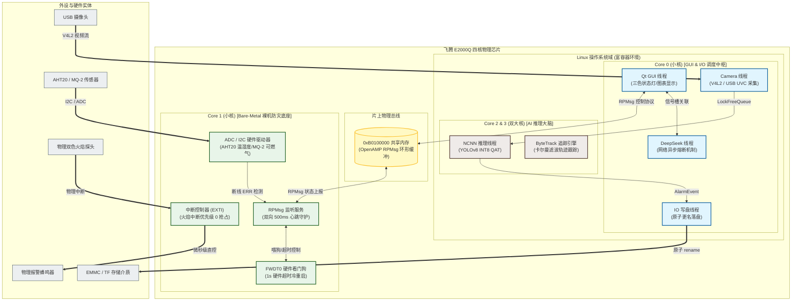
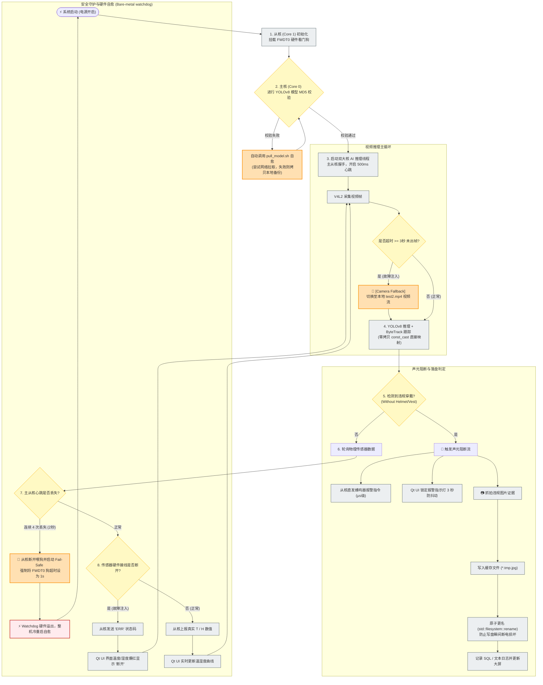

# 系统架构图与核心业务流程图 (CICC 答辩专用)

本篇文档基于 **0.2.1 异构多核系统框架 (Linux + Bare-Metal)** 与 **0.2.2 核心业务流程 (视频拉取 -> AI 推理 -> 声光阻断 -> 证据落盘)**，结合飞腾派 E2000Q 物理硬件映射，绘制了高可视化的系统架构图和业务流程图。可作为技术报告插图或 PPT 展示。

---

## 1. 0.2.1 飞腾 E2000Q 异构多核系统架构图 (AMP)

本系统采用 **AMP (非对称多处理) 架构**，对飞腾 E2000Q 的 4 个物理核心进行了硬隔离划分：
- **Core 0 (小核)**：运行 Linux OS，负责轻量级 I/O、X11 GUI 渲染与 HTTP 网络通信。
- **Core 1 (小核)**：运行 **Bare-Metal (裸机防灾底座)**，接管硬件中断与物理看门狗。
- **Core 2 & 3 (大核)**：运行 Linux 主推理进程，通过核心亲和性绑定，强行压榨双大核进行 YOLOv8 矩阵乘法加速。
- **双核通道**：通过设备树划定的 `0xB0100000` 物理片上共享内存，实现基于 OpenAMP RPMsg 的跨核可信通信总线。

---

## 2. 0.2.2 全系统业务流与防灾控制流程图

该图展现了从 **图像采集 -> AI 推理与去抖 -> 异常判定与硬件级声光阻断 -> 证据落盘** 的端到端时序与控制防线：
- **防线 1 (自愈防线)**：V4L2 摄像头超时 $3\text{s}$ 自动降级本地 MP4；
- **防线 2 (校验防线)**：YOLOv8 模型启动 MD5 校验，失败则触发 `pull_model.sh` 远程/本地双重自愈恢复；
- **防线 3 (外设防线)**：从核断线发送 `"ERR"`，UI 强制变红显示 `"断开"`；
- **防线 4 (可靠防线)**：心跳连续 $4$ 次丢失（$2\text{s}$），从核缩短看门狗至 $1\text{s}$ 并不喂狗，冷重启整机。

