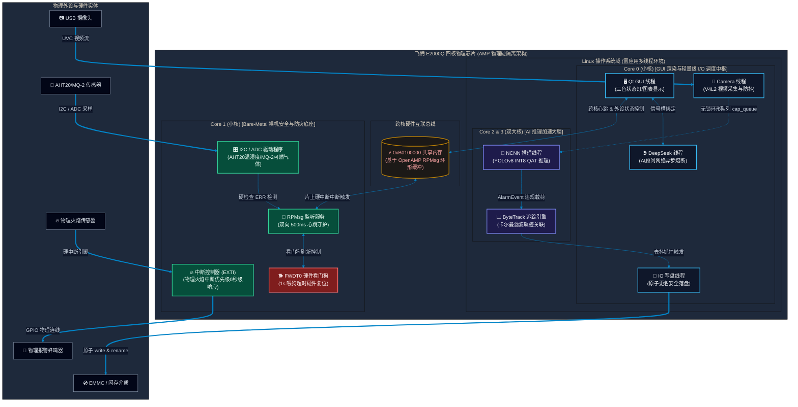
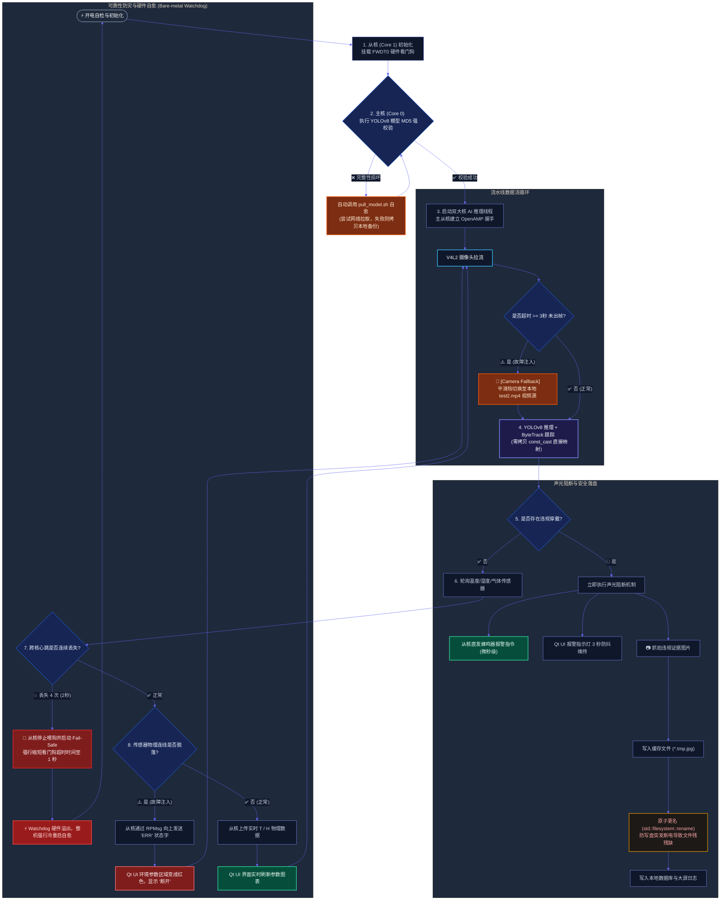

# 系统架构与核心业务流程图 (CICC 答辩专用)

本篇文档基于 **0.2.1 异构多核系统框架 (Linux + Bare-Metal)** 与 **0.2.2 核心业务流程**，使用 Mermaid 进行了视觉重构。同时，附带了可用于答辩 PPT 报告的扁平化系统架构图和业务流水线拓扑图设计：

### 📸 CICC 答辩标准系统架构图 (0.2.1)

### 📸 CICC 答辩核心业务流程图 (0.2.2)

---

## 1. 0.2.1 飞腾 E2000Q 异构多核系统架构图 (AMP)

---

## 2. 0.2.2 全系统业务流与防灾控制流程图

